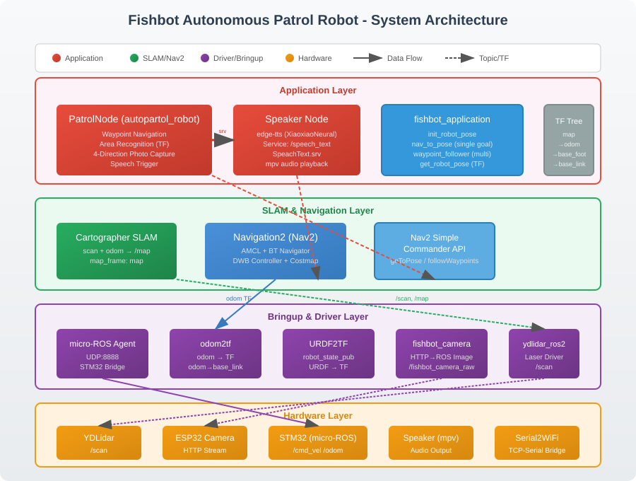
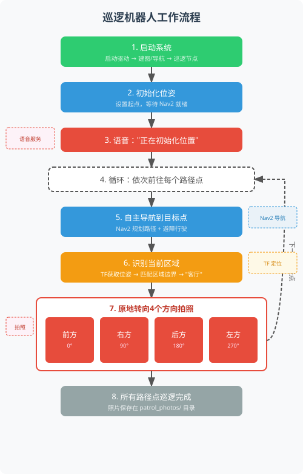

# Fishbot Autonomous Patrol Robot

基于 ROS2 Humble 的自主巡逻机器人，集成激光雷达 SLAM 建图、Nav2 自主导航、语音播报、区域识别和多点巡逻拍照功能。机器人能够按预设路径点自主导航，到达后通过 TF 获取位姿判断所在区域，原地转向 4 个方向各拍一张照片，全程语音播报。

## 系统架构



系统采用四层分层架构：

| 层级 | 功能 | 涉及的包 |
|------|------|----------|
| Application Layer | 巡逻逻辑、语音播报、导航工具 | `autopartol_robot`, `autopartol_interfaces`, `fishbot_application` |
| SLAM & Navigation Layer | 建图、定位、路径规划 | `fishbot_cartographer`, `fishbot_navigation2` |
| Bringup & Driver Layer | 传感器驱动、TF 广播 | `fishbot_bringup`, `fishbot_camera`, `ros_serial2wifi`, `ydlidar_ros2`, `micro-ROS-Agent` |
| Hardware Layer | 物理设备 | YDLidar, ESP32-CAM, STM32 (micro-ROS), Speaker |

## 巡逻工作流



### TF 坐标树

```
map                          ← AMCL (fishbot_navigation2)
 └── odom                    ← odom2tf (fishbot_bringup) / micro-ROS Agent
      └── base_footprint     ← URDF2TF (fishbot_bringup)
           └── base_link    ← robot_state_publisher (fishbot_bringup)
```

## 功能模块

### 1. autopartol_robot — 巡逻主节点

| 功能 | 说明 |
|------|------|
| 多点导航 | 从 `partol_config.yaml` 读取路径点，依次导航 |
| 区域识别 | 通过 TF 获取实时位姿，与预设区域边界匹配 |
| 4 方向拍照 | 到达后原地转向 0/90/180/270 度各拍一张照片 |
| 语音播报 | 全程通过 edge-tts 服务播报状态 |
| 相机集成 | 订阅 ESP32-CAM 图像话题，cv_bridge 转换后保存 |

**核心节点：**
- `PatrolNode` (继承 `BasicNavigator`) — 巡逻主逻辑
- `Speaker` — 语音合成服务端 (edge-tts + mpv)

### 2. autopartol_interfaces — 自定义服务接口

```
# srv/SpeachText.srv
string text      # 要播报的文本
---
bool result      # 播报是否成功
```

### 3. fishbot_application — 导航工具集

| 节点 | 功能 |
|------|------|
| `init_robot_pose` | 初始化机器人位姿 |
| `get_robot_pose` | 通过 TF 获取实时位姿 |
| `nav_to_pose` | 单点导航 |
| `waypoint_flollower` | 多航点依次导航 |

### 4. fishbot_cartographer — SLAM 建图

使用 Google Cartographer 进行 2D SLAM 建图，输入 `/scan` 和 `/odom`，输出 `/map`。

### 5. fishbot_navigation2 — 自主导航

基于 Nav2 栈实现自主导航，包含 AMCL 定位、BT Navigator 行为树、DWB 局部规划器、全局/局部代价地图。

### 6. fishbot_bringup — 底层驱动

| 节点 | 功能 |
|------|------|
| `odom2tf` (C++) | 将 `/odom` 话题转为 TF 变换 (odom → base_footprint) |
| `urdf2tf` | 发布 URDF 模型，启动 robot_state_publisher |
| micro-ROS Agent | UDP:8888 桥接 STM32 |
| ydlidar_ros2 | 激光雷达驱动，输出 `/scan` |
| ros_serial2wifi | TCP-串口桥接 |

### 7. fishbot_camera — ESP32-CAM 驱动

通过 UDP 广播发现 ESP32-CAM，建立 HTTP 流连接，将 JPEG 帧解码为 ROS Image 消息发布到 `/fishbot_camera_raw`。

### 8. fishbot_description — 机器人 URDF 模型

定义机器人 URDF 模型，包含轮子、雷达、传感器等关节。

## 依赖安装

### 系统依赖（apt 安装）

```bash
sudo apt update
sudo apt install -y \
  ros-humble-nav2-bringup \
  ros-humble-nav2-simple-commander \
  ros-humble-cartographer-ros \
  ros-humble-tf2-ros \
  ros-humble-tf-transformations \
  ros-humble-cv-bridge \
  ros-humble-robot-state-publisher \
  ros-humble-joint-state-publisher \
  ros-humble-rviz2 \
  ros-humble-sensor-msgs \
  ros-humble-geometry-msgs \
  ros-humble-nav-msgs \
  ros-humble-rclpy \
  ros-humble-rclcpp \
  ros-humble-rosidl-default-generators \
  python3-opencv \
  mpv
```

### Python 依赖（pip 安装）

```bash
pip install edge-tts
```

### 第三方功能包

| 功能包 | 说明 | 来源 |
|--------|------|------|
| `micro-ROS-Agent` | STM32 micro-ROS 桥接 | 已包含在 `src/micro-ROS-Agent` |
| `micro_ros_msgs` | micro-ROS 消息定义 | 已包含在 `src/micro_ros_msgs` |
| `ydlidar_ros2` | YDLidar 驱动 | 已包含在 `src/ydlidar_ros2` |

## 编译

```bash
cd ~/ros2_ws  # 你的 ROS2 工作空间根目录
# 将 src/ 目录下所有包复制到工作空间的 src/ 下
colcon build --symlink-install
source install/setup.bash
```

## 启动顺序

### 第 1 步：底层驱动（Bringup）

```bash
# 启动激光雷达、里程计 TF、micro-ROS Agent、串口桥接
ros2 launch fishbot_bringup bringup.launch.py
```

这一步会启动：
- YDLidar 驱动 → 发布 `/scan`
- odom2tf → 将里程计话题转为 TF (odom → base_footprint)
- URDF2TF → 发布机器人模型 TF
- micro-ROS Agent → 桥接 STM32 (UDP:8888)
- ros_serial2wifi → TCP-串口桥接

### 第 2 步：SLAM 建图（首次使用或需要重建地图时）

```bash
# 使用 Cartographer 建图
ros2 launch fishbot_cartographer cartographer_slam.launch.py
```

建图完成后保存地图：
```bash
ros2 run nav2_map_server map_saver_cli -f ~/ros2_ws/src/fishbot_navigation2/maps/room
```

### 第 3 步：自主导航（Nav2）

```bash
# 启动 Nav2 导航栈（使用已有地图）
ros2 launch fishbot_navigation2 navigation2.launch.py
```

这一步会启动：
- AMCL 自适应蒙特卡洛定位
- BT Navigator 行为树导航器
- DWB 局部规划器
- 全局/局部代价地图
- RViz2 可视化

### 第 4 步：巡逻任务

```bash
# 启动巡逻机器人（巡逻节点 + 语音服务 + 相机）
ros2 launch autopartol_robot autopatol.launch.py
```

这一步会启动：
- PatrolNode — 巡逻主逻辑
- Speaker — 语音合成服务
- fishbot_camera — ESP32-CAM 相机驱动（可选，通过 `use_camera` 参数控制）

> 单独启动语音服务：`ros2 run autopartol_robot speaker`
> 单独启动巡逻节点：`ros2 run autopartol_robot partol_node`

### 完整启动顺序（按终端依次执行）

```bash
# Terminal 1 — 底层驱动
ros2 launch fishbot_bringup bringup.launch.py

# Terminal 2 — SLAM 建图（建图阶段才需要，已有地图可跳过）
ros2 launch fishbot_cartographer cartographer_slam.launch.py

# Terminal 3 — Nav2 导航
ros2 launch fishbot_navigation2 navigation2.launch.py

# Terminal 4 — 巡逻机器人
ros2 launch autopartol_robot autopatol.launch.py
```

## 配置说明

### 巡逻路径点配置

编辑 `autopartol_robot/config/partol_config.yaml`：

```yaml
patrol_node:
  ros__parameters:
    initial_point: [0.0, 0.0, 0.0]       # 初始位姿 [x, y, yaw]
    target_points: [                      # 巡逻目标点，每3个数一组 [x, y, yaw]
      0.03, 0.26, 0.0,                    # 原点中心
      2.35, 1.53, 0.0,                    # 客厅1
      2.86, -1.16, 0.0,                  # 客厅2
      2.15, -1.02, 0.0,                   # 客厅3
      0.03, 0.26, 0.0,                   # 返回原点
    ]
    area_names: ["原点", "客厅1", "客厅2", "客厅3"]
    area_bounds: [
      -0.71, 0.76, -0.1, 0.63,            # x_min, x_max, y_min, y_max
      0.9, 3.8, -0.1, 3.16,
      1.79, 3.92, -2.25, -0.07,
      1.9, 2.4, -1.38, -0.65,
    ]
    enable_camera: true                   # 是否启用相机
    camera_topic: /fishbot_camera_raw      # 相机话题
    photo_save_dir: patrol_photos         # 照片保存目录
```

## 项目结构

```
src/
├── autopartol_robot/          # 巡逻机器人主包
│   ├── autopartol_robot/
│   │   ├── partol_node.py     # 巡逻主节点
│   │   └── speaker.py         # 语音合成服务节点
│   ├── config/
│   │   └── partol_config.yaml # 巡逻配置
│   ├── launch/
│   │   └── autopatol.launch.py
│   └── setup.py
├── autopartol_interfaces/     # 自定义服务接口
│   └── srv/
│       └── SpeachText.srv
├── fishbot_application/       # 导航工具集
│   └── fishbot_application/
│       ├── init_robot_pose.py
│       ├── get_robot_pose.py
│       ├── nav_to_pose.py
│       └── waypoint_flollower.py
├── fishbot_bringup/          # 底层驱动
│   ├── launch/
│   │   ├── bringup.launch.py
│   │   └── urdf2tf.launch.py
│   └── src/
│       └── odom2tf.cpp        # 里程计→TF (C++)
├── fishbot_cartographer/      # SLAM 建图
│   ├── config/
│   │   └── fishbot_slam.lua
│   └── launch/
│       └── cartographer_slam.launch.py
├── fishbot_navigation2/       # Nav2 导航
│   ├── config/
│   │   └── nav2_params.yaml
│   ├── launch/
│   │   └── navigation2.launch.py
│   └── maps/
│       ├── room.pgm
│       └── room.yaml
├── fishbot_description/       # URDF 模型
│   └── urdf/
│       └── fishbot.urdf
├── fishbot_camera/           # ESP32-CAM 驱动
│   └── fishbot_camera/
│       └── camera_driver.py
├── ros_serial2wifi/          # TCP-串口桥接
├── micro-ROS-Agent/         # micro-ROS Agent
├── micro_ros_msgs/          # micro-ROS 消息
├── ydlidar_ros2/            # 激光雷达驱动
└── docs/
    └── assets/
        ├── architecture.svg  # 系统架构图
        └── patrol_flow.svg   # 巡逻流程图
```

## 技术栈

| 技术 | 版本 | 用途 |
|------|------|------|
| ROS2 | Humble | 机器人操作系统 |
| Cartographer | - | 2D SLAM 建图 |
| Nav2 | - | 自主导航栈 |
| OpenCV | 4.x | 图像处理 |
| edge-tts | - | 语音合成 (zh-CN-XiaoxiaoNeural) |
| mpv | - | 音频播放 |
| micro-ROS | - | STM32 通信 |
| Python | 3.10+ | 节点开发 |
| C++ | 17 | odom2tf 节点 |

## License

MIT
